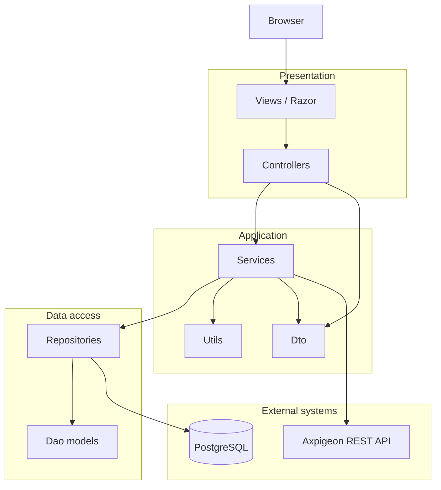
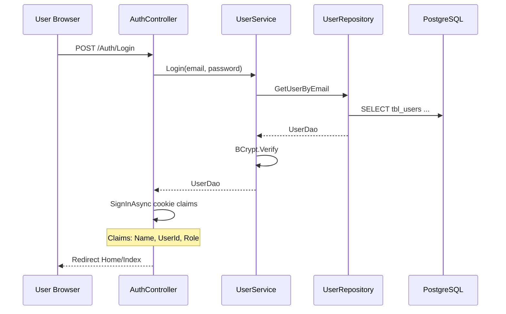

# Axpigeon Merchant App — Architecture & Integration Guide

This document describes how **AxpigeonMerchantApp** is structured today, how its layers interact, and how to add new features in a way that matches existing patterns. It is intended for developers integrating new merchant-facing functionality.

---

## 1. What this application is

**AxpigeonMerchantApp** is an ASP.NET Core **MVC (Razor Views)** web portal for merchants. It:

- Authenticates users with **cookie-based** sessions (`AxPCookieAuth`).
- Reads and writes merchant data in a **PostgreSQL** database via raw SQL (`Npgsql`).
- Calls the external **Axpigeon REST API** (`API_BASE_URL`) for SMS operations (login token, send single, send bulk).

The app is **not** a pure API backend; the primary UI is server-rendered Razor under `Views/`, with static assets under `wwwroot/`.

---

## 2. High-level architecture

### 2.1 Layer diagram



### 2.2 Request flow (typical read feature)

1. Browser hits a route, e.g. `GET /Transactions/Index`.
2. **Controller** reads `UserId` from claims, validates `[Authorize(Roles = "MERCHANT")]`, calls **Service**.
3. **Service** may map `Dao` → `Dao` (light transformation) and delegates to **Repository**.
4. **Repository** opens `NpgsqlConnection`, runs parameterized SQL, maps rows to **Dao** types, returns to Service.
5. Controller returns `View(model)`; Razor renders HTML.

### 2.3 Request flow (DB + external API — SMS example)

Used by **Transactions → Send Message**:

1. Controller validates form → `SendMessageDto`.
2. **TransactionsService** loads branch credentials from DB via **TransactionsRepository** (`FindValidMerchantAsync`).
3. Service obtains API JWT via `POST {BaseUrl}/api/auth/login`.
4. Service encrypts message with `EncryptUtil` (AES-256-CBC, key/IV derived from `secret_key`).
5. Service calls `POST {BaseUrl}/api/sms/send` or `/api/sms/bulk` with `Authorization: Bearer {token}`.
6. Service deserializes response into `SingleMessageRespDao` and checks `status == "00"`.

---

## 3. Layers and responsibilities

| Layer | Folder | Responsibility | Depends on |
|-------|--------|----------------|------------|
| **Presentation** | `Controllers/`, `Views/`, `wwwroot/` | HTTP routing, auth attributes, model validation, Razor UI | Services, Dto, Models |
| **Application / business** | `Services/` | Orchestration, password hashing, encryption, HTTP calls to Axpigeon API, mapping | Repositories, Dto, Dao, Utils, `IConfiguration` |
| **Data access** | `Repository/` | SQL queries, transactions, row mapping | `IConfiguration` → connection string, Dao |
| **Contracts (inbound)** | `Dto/` | Form/API input from user actions | — |
| **Contracts (internal)** | `Dao/` | DB row shapes, paginated lists, **and** some external API JSON shapes | — |
| **Cross-cutting** | `Configuration/`, `Extensions/`, `Middleware/`, `Utils/`, `Enum/`, `Exceptions/` | Startup config, DI registration, helpers, constants | — |
| **Shared UI models** | `Models/` | Small view-specific models (e.g. `ErrorViewModel`) | — |

There are **four logical tiers** in practice: **Controller → Service → Repository → Database/API**. Dto/Dao are type layers, not runtime tiers.

### 3.1 Controllers (`Controllers/`)

- MVC controllers; one controller per area (`Auth`, `Home`, `Merchant`, `Transactions`, `Error`).
- Use **primary constructor** DI: `public class XController(IService service) : Controller`.
- Extract current user: `Guid.Parse(User.FindFirstValue("UserId"))`.
- Protect merchant pages: `[Authorize(Roles = "MERCHANT")]`.
- POST actions use `[ValidateAntiForgeryToken]` where forms post back.
- Use `TempData` for flash messages after redirect (see `MerchantController.ChangePassword`).

**Active controllers today**

| Controller | Main routes | Service(s) |
|------------|-------------|------------|
| `AuthController` | Login, Logout, AccessDenied | `IUserService` |
| `HomeController` | Dashboard `Index` | `IHomeService` |
| `MerchantController` | Branch list, Change password | `IMerchantService` |
| `TransactionsController` | Transaction list, Send SMS | `ITransactionsService` |
| `ErrorController` | Custom 404 | — |

> **Note:** `IKeyService` / `KeyService` are registered in DI but have **no controller** in this project yet. Follow the same pattern when exposing key/password admin UI.

### 3.2 Services (`Services/`)

- **Scoped** lifetime (`AddAppServices` in `Extensions/ServiceRegistration.cs`).
- Business rules: BCrypt verify/hash, Excel parsing (EPPlus), external API calls (`HttpClient`).
- Interface + implementation per domain: `IUserService`/`UserService`, `IMerchantService`/`MerchantService`, etc.
- Namespace split (historical): `UserService` lives in `AxpigeonApp.Service`; others in `AxpigeonApp.Services`. New code should prefer **`AxpigeonApp.Services`** unless matching an existing file.

**When to put logic in Service vs Repository**

| Put in **Service** | Put in **Repository** |
|--------------------|------------------------|
| Password hashing, validation rules | SQL, joins, pagination queries |
| Calling external HTTP APIs | `BEGIN`/`COMMIT` transactions across tables |
| Mapping Dao lists (optional duplicate mapping) | Decrypting DB-stored messages (today in `TransactionsRepository`) |
| File upload / Excel processing | Parameterized commands only |

### 3.3 Repositories (`Repository/`)

- **Scoped** (`Extensions/RepositoryRegistration.cs`).
- Constructor reads `IConfiguration.GetConnectionString("DefaultConnection")`.
- Uses **`NpgsqlConnection`** + **`NpgsqlCommand`** (no Entity Framework, no active Dapper usage).
- Multi-step writes use `BeginTransactionAsync()` / `CommitAsync()` / `RollbackAsync()` (see `MerchantRepository.Create`, `KeyGenerate`).

### 3.4 Dto vs Dao

| Type | Folder | Purpose | Example |
|------|--------|---------|---------|
| **Dto** | `Dto/` | Input from forms / user actions | `SendMessageDto`, `MerchantCreateDto`, `AddPasswordDto` |
| **Dao** | `Dao/` | Data shapes from DB or deserialized API JSON | `UserDao`, `TransactionListDao`, `AuthTokenResponseDao`, `PaginatedList<T>` |

Naming convention in this codebase: suffix **`Dto`** = inbound; **`Dao`** = persistence or API payload (including responses). Keep that distinction for consistency.

### 3.5 Views (`Views/`)

- Razor templates aligned with controller names: `Views/Transactions/Index.cshtml`, etc.
- `_ViewStart.cshtml` sets default layout; `_ViewImports.cshtml` imports namespaces and tag helpers.
- `_Layout.cshtml` — main app chrome; `_AuthLayout.cshtml` — login/auth pages.
- Page models are often **Dao** types or `PaginatedList<T>` passed from controllers.

### 3.6 Utils, Enum, Exceptions, Middleware

| Folder | Role |
|--------|------|
| `Utils/EncryptUtil.cs` | AES encrypt for SMS `messageHash` (must stay compatible with backend/Java) |
| `Enum/` | `RoleType`, `UserStatus`, `TransactionStatus` — use for new code instead of magic strings where possible |
| `Exceptions/StatusCode.cs` | Auth-related string constants (`ERR000`, etc.) |
| `Middleware/` | `AuthMiddleware`, `RoleMiddleware` exist but are **not wired** in `Program.cs`. Authorization is done via **`[Authorize]`** and cookie auth. Do not register custom middleware unless you intentionally replace that approach. |

### 3.7 Configuration (`Configuration/`)

- `EnvConfiguration.LoadDotEnv()` — loads `.env` via **DotNetEnv**.
- `BuildConfigurationOverrides()` — maps env vars into `IConfiguration` keys (connection string, JWT settings, API base URL).

### 3.8 Extensions (`Extensions/`)

- **`ServiceRegistration.cs`** — register all `I*Service` → implementations.
- **`RepositoryRegistration.cs`** — register all `I*Repository` → implementations.

**Rule:** Every new Service/Repository pair must be added here.

### 3.9 Models (`Models/`)

- Thin types for views that are not domain entities (e.g. `ErrorViewModel`).

### 3.10 `ExternalApi/` (placeholder)

- Listed as an empty folder in `AxpigeonApp.csproj`. External HTTP logic currently lives inside **`TransactionsService`**. For new API integrations, either:
  - Add dedicated client classes under `ExternalApi/` and inject them into services, or
  - Follow the existing `TransactionsService` + `HttpClient` pattern until a refactor is agreed.

---

## 4. Technologies and libraries

| Concern | Technology | Usage in project |
|---------|------------|------------------|
| Runtime | **.NET 10** (`net10.0`) | Web SDK project |
| Web framework | **ASP.NET Core MVC** | Controllers + Razor |
| Database | **PostgreSQL 15** (via `docker-compose.yml`) | Primary data store |
| DB driver | **Npgsql** 10.x | All repository access |
| Micro-ORM | **Dapper** (package referenced) | **Not used** in code today; repositories use raw ADO.NET |
| ORM / migrations | **dotnet-ef** in `dotnet-tools.json` | Tool present; **no EF DbContext** in repo |
| Password hashing | **BCrypt.Net-Next** | Login + password change |
| Excel | **EPPlus** | Bulk SMS template parsing |
| HTTP client | **`IHttpClient` via `AddHttpClient()`** | Axpigeon API from `TransactionsService` |
| API docs (dev) | **Swashbuckle** | Swagger UI in Development only |
| Env files | **DotNetEnv** + manual `.env` parsing in `Program.cs` | Secrets and connection strings |
| Auth (browser) | **Cookie authentication** (`AxPCookieAuth`) | 30-minute session |
| Auth (external API) | Bearer JWT from `/api/auth/login` | Per-request in SMS flow |
| JWT packages | `Microsoft.AspNetCore.Authentication.JwtBearer`, `System.IdentityModel.Tokens.Jwt` | Config loaded; **merchant session is cookie-based**, not JWT |

---

## 5. External integrations

### 5.1 PostgreSQL

**Connection string** is built from `.env`:

- `DB_HOST`, `DB_PORT`, `DB_NAME`, `DB_USERNAME`, `DB_PASSWORD`

Mapped to `ConnectionStrings:DefaultConnection` in `Program.cs` and `EnvConfiguration`.

**Core tables referenced in code** (not exhaustive schema doc):

| Table | Typical use |
|-------|-------------|
| `tbl_users` | Login, roles (`MERCHANT`, `BRANCH`), links to merchant/branch |
| `tbl_merchants` | Merchant master |
| `tbl_branches` | Sub-merchants / brands |
| `tbl_transactions` | SMS transaction history |
| `tbl_provider` | SMS providers |
| `tbl_sms_info` | SMS package balances per branch |
| `tbl_credentials` | `secret_key`, `sender_id` for encryption |
| `tbl_api_gateway` | API username/password for Axpigeon login |
| `tbl_message_decrypt` | Encrypted message passwords |

Local DB: `docker compose up` uses `docker-compose.yml` (Postgres 15, port 5432).

### 5.2 Axpigeon REST API

Configured via **`API_BASE_URL`** → `AxpigeonApi:BaseUrl` (e.g. `http://localhost:8080` or `https://api.axpigeon.com`).

| Endpoint | Method | Used by | Purpose |
|----------|--------|---------|---------|
| `/api/auth/login` | POST | `TransactionsService.GetTokenAsync` | Username/password → JWT in `AuthTokenResponseDao.data` |
| `/api/sms/send` | POST | `TransactionsService.SendSingleMessage` | Single SMS |
| `/api/sms/bulk` | POST | `TransactionsService.SendBulkMessage` | Bulk SMS |

**Auth:** `Authorization: Bearer {token}` where token comes from login response (`status` must be `"000"` for auth, `"00"` for SMS responses).

**Payload:** camelCase JSON (`brandName`, `messageHash`, `senderId`, `isSendNow`, etc.). Message body is **encrypted** before send (`EncryptUtil.EncryptMessage`).

### 5.3 Authentication model (this app)



**Roles in use:** `MERCHANT` (main portal user). Enum also defines `ADMIN`, `TECHNICIAN`, `BRANCH` for data model / future screens.

**Claims set at login** (`AuthController`):

- `ClaimTypes.Name` — merchant display name  
- `"UserId"` — `Guid` as string  
- `ClaimTypes.Role` — e.g. `MERCHANT`

---

## 6. Application startup (`Program.cs`)

Order of concerns:

1. `EnvConfiguration.LoadDotEnv()`
2. Build config overrides from env
3. Optional second pass: read `.env` into `Environment` and set connection string / JWT / API URL
4. `AddHttpClient()`, `AddControllersWithViews()`, Swagger (dev)
5. `AddAppRepositories()`, `AddAppServices()`
6. Cookie authentication scheme `AxPCookieAuth`
7. Pipeline: Swagger (dev) → status code pages → HTTPS → static files → routing → auth → default route

Default route: `{controller=Home}/{action=Index}/{id?}`.

---

## 7. Root directory files (documentation-relevant)

| File / folder | Purpose |
|---------------|---------|
| `Program.cs` | Application entry, middleware pipeline, DI, env → configuration |
| `AxpigeonApp.csproj` | Project file, NuGet packages, target framework |
| `AxpigeonApp.slnx` | Solution file for opening in IDE |
| `appsettings.json` | Logging levels, placeholder `ConnectionStrings`, `Jwt`, `AxpigeonApi` (overridden by `.env`) |
| `appsettings.Development.json` | Development logging overrides |
| `Configuration/` | `.env` → `IConfiguration` mapping |
| `Extensions/` | Central DI registration for services and repositories |
| `Properties/launchSettings.json` | Local URLs (`http://localhost:5029`, `https://localhost:7030`) |
| `Properties/PublishProfiles/` | Folder publish profiles for deployment |
| `docker-compose.yml` | Local PostgreSQL container |
| `dotnet-tools.json` | Local dotnet tools (`dotnet-ef`) |
| `wwwroot/` | Static CSS/JS/images/plugins (theme assets, DataTables, etc.) |

**Intentionally omitted from this guide:** `.gitignore`, `.env` (secrets), build artifacts, `AxpigeonApp.csproj.Backup.tmp`.

---

## 8. Complete feature iteration (step-by-step)

Use this checklist when adding a new merchant feature (example: **“Reports”**).

### Step 1 — Define the feature contract

- [ ] **Dto** for form/query input (`Dto/ReportFilterDto.cs`) if user submits data.
- [ ] **Dao** for DB rows and pagination (`Dao/ReportRowDao.cs`, reuse `PaginatedList<T>` if listing).

### Step 2 — Data access

- [ ] `IReportRepository` + `ReportRepository` in `Repository/`.
- [ ] Use `NpgsqlConnection`, parameterized `@params`, `using`/`await using` for disposal.
- [ ] Resolve `merchant_id` from `userId` the same way as `TransactionsRepository` / `MerchantRepository` if data is merchant-scoped.
- [ ] Use transactions for multi-table writes.
- [ ] Register in `Extensions/RepositoryRegistration.cs`:  
  `services.AddScoped<IReportRepository, ReportRepository>();`

### Step 3 — Application logic

- [ ] `IReportService` + `ReportService` in `Services/`.
- [ ] Inject repository (+ `HttpClient` / `IConfiguration` only if calling Axpigeon API).
- [ ] Keep validation and business rules here (not in controller).
- [ ] Register in `Extensions/ServiceRegistration.cs`.

### Step 4 — HTTP / UI

- [ ] `ReportController` with `[Authorize(Roles = "MERCHANT")]` on actions.
- [ ] GET: load data, `return View(model)`.
- [ ] POST: accept Dto, `ModelState`, `[ValidateAntiForgeryToken]`, call service, redirect with `TempData` on success.
- [ ] Views under `Views/Report/` (`.cshtml` + optional `.cshtml.cs` code-behind if used).

### Step 5 — Navigation and assets

- [ ] Add link in `Views/Shared/_Layout.cshtml` (or relevant menu partial).
- [ ] Add JS/CSS under `wwwroot/` only if needed; follow existing `wwwroot/js/pages/` patterns.

### Step 6 — Configuration

- [ ] If new env vars are required, extend `EnvConfiguration.BuildConfigurationOverrides()` and document vars in team `.env.example` (do not commit secrets).

### Step 7 — External API (if applicable)

- [ ] Add typed request/response **Dao** classes matching API JSON.
- [ ] Centralize base URL: `config["AxpigeonApi:BaseUrl"]`.
- [ ] Use `HttpRequestMessage` + Bearer token; check API `status` codes consistently (`"000"` auth, `"00"` SMS).
- [ ] Reuse `EncryptUtil` for any `messageHash` fields.

### Step 8 — Verify

- [ ] Login as `MERCHANT`, exercise happy path and validation errors.
- [ ] Test against local API (`API_BASE_URL=http://localhost:8080`) and DB (`docker compose`).
- [ ] Confirm unauthorized users get login or access denied.

---

## 9. Reference implementation: Transactions (SMS)

Best end-to-end example in the codebase:

| Step | Location |
|------|----------|
| View | `Views/Transactions/SendMessage.cshtml`, `Index.cshtml` |
| Controller | `Controllers/TransactionsController.cs` |
| Input Dto | `Dto/SendMessageDto.cs` |
| Service + API | `Services/TransactionsService.cs` |
| Repository + SQL | `Repository/TransactionsRepository.cs` |
| API response Dao | `Dao/SingleMessageRespDao.cs`, `Dao/AuthTokenResponseDao.cs` |
| Encryption | `Utils/EncryptUtil.cs` |

**Simpler DB-only example:** `MerchantController` → `MerchantService` → `MerchantRepository` (change password, list branches).

**Simpler read-only dashboard:** `HomeController` → `HomeService` → `HomeRepository`.

---

## 10. Conventions and pitfalls

1. **Always register new services/repositories** in `Extensions/` — otherwise DI fails at runtime.
2. **Merchant scoping:** Most queries first resolve `merchant_id` from `tbl_users` where `id = @userId`.
3. **Passwords:** Store with `BCrypt.Net.BCrypt.HashPassword`; verify with `BCrypt.Verify`.
4. **Dao mapping in services:** Many services copy Dao → Dao identically; acceptable pattern here but avoid unnecessary duplication when types are identical.
5. **Dapper / EF:** Packages exist; **repositories use Npgsql only**. Do not introduce EF without team agreement.
6. **Middleware:** `AuthMiddleware` / `RoleMiddleware` are unused; prefer `[Authorize]`.
7. **Namespace:** `AxpigeonApp.Service` vs `AxpigeonApp.Services` — align new services to `Services` namespace.
8. **API status codes:** Auth uses `"000"`; SMS operations expect `"00"` — check both when integrating new endpoints.
9. **Encryption:** `secret_key` formatting (32-byte key, 16-byte IV from UTF-8 bytes) must match the main Axpigeon/Java backend.
10. **Empty `ExternalApi/` folder:** Consider moving HTTP client code there when adding second or third API integrations.

---

## 11. Environment variables (integration)

| Variable | Maps to | Used for |
|----------|---------|----------|
| `DB_HOST`, `DB_PORT`, `DB_NAME`, `DB_USERNAME`, `DB_PASSWORD` | `ConnectionStrings:DefaultConnection` | PostgreSQL |
| `JWT_KEY`, `JWT_ISSUER`, `JWT_AUDIENCE` | `Jwt:*` | Loaded; reserved for future JWT features |
| `API_BASE_URL` | `AxpigeonApi:BaseUrl` | Axpigeon REST API |
| `POSTGRES_*` (in docker-compose) | Docker Postgres container | Local dev database only |

---

## 12. Current module map (quick reference)

```
Controllers/     → HTTP + authorization + views
Services/        → Business logic + external API (Transactions)
Repository/      → SQL (Npgsql)
Dto/             → Request/form models
Dao/             → DB + API data shapes
Views/           → Razor UI
wwwroot/         → Static assets
Configuration/   → Env → config
Extensions/      → DI registration
Utils/           → Encryption helpers
Enum/            → Role/status enums
Middleware/      → (present, not active in pipeline)
Models/          → Minor view models
Exceptions/      → Status code constants
```

---

## 13. Related documents

When adding features, keep this guide updated if you:

- Introduce a new integration (payment, webhook, etc.).
- Change authentication (e.g. enable JWT for SPA).
- Move API clients into `ExternalApi/`.
- Adopt Dapper or EF for data access.

---

*Generated from codebase analysis of AxpigeonMerchantApp. Align new work with the patterns above unless the team agrees on an intentional architectural change.*
