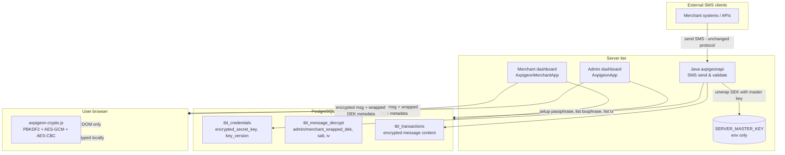

# AxPigeon Message Encryption & Security Flow

This document describes the **enhanced envelope encryption** introduced across the AxPigeon platform: the **Java SMS API** (`axpigeonapi`), the **Admin dashboard** (`AxpigeonApp`), and the **Merchant dashboard** (`AxpigeonMerchantApp`).

It is written for two audiences:

- **Business / project stakeholders** — Sections marked *For non-technical readers* explain *why* we changed the design and what risk is reduced, without code.
- **Developers** — Later sections explain database fields, components, and step-by-step technical flows.

The same file is copied into each project’s `document/` folder because the feature is **one cross-cutting security design** implemented in three applications that share one database.

---

## Table of contents

1. [Executive summary (non-technical)](#1-executive-summary-non-technical)
2. [What was wrong with the old flow](#2-what-was-wrong-with-the-old-flow)
3. [Core concepts (glossary)](#3-core-concepts-glossary)
4. [High-level architecture](#4-high-level-architecture)
5. [How the three systems work together](#5-how-the-three-systems-work-together)
6. [Business flows (step by step)](#6-business-flows-step-by-step)
7. [Security: old vs new (comparison)](#7-security-old-vs-new-comparison)
8. [Threat scenarios](#8-threat-scenarios)
9. [Database design](#9-database-design)
10. [Technical implementation by project](#10-technical-implementation-by-project)
11. [Client-side decryption (browser)](#11-client-side-decryption-browser)
12. [Backward compatibility](#12-backward-compatibility)
13. [Configuration & operations](#13-configuration--operations)
14. [File reference (where to look in code)](#14-file-reference-where-to-look-in-code)

---

## 1. Executive summary (non-technical)

*For non-technical readers*

AxPigeon sends SMS messages whose **content is encrypted** so that only authorized parties can read them. In the past, anyone who could log into the **admin dashboard** (or read certain database tables) could often see **full message text in plain language** on screen or in logs.

The **new design** separates two ideas:

| Idea | Plain-language meaning |
|------|------------------------|
| **Sending SMS** | The server must still encrypt and deliver messages to carriers. That requires a technical “message key” stored in a controlled way on the server. |
| **Reading SMS in a dashboard** | Operators should only see message text **after they enter a viewing passphrase** they chose. The passphrase is **never stored** on the server. |

So:

- **Admin staff** set an **admin viewing passphrase** per branch. It unlocks messages only in the admin dashboard.
- **Merchant users** set a **merchant viewing passphrase** per branch. It unlocks messages only in the merchant dashboard.
- These passphrases are **independent** — knowing one does not reveal the other.

If someone breaks into the database or steals a backup, they see **encrypted blobs**, not readable SMS text. If someone compromises an admin account, they still need the **viewing passphrase** to read message content in the browser.

**SMS sending for external clients is unchanged** — existing integrations do not need a new encryption protocol.

---

## 2. What was wrong with the old flow

*For non-technical readers*

Previously, the system often worked like this:

1. Each branch had a **secret key** stored in the database (sometimes in plain form).
2. Messages were encrypted with that key before storage or display.
3. The dashboard **decrypted messages on the server** and sent **plain text** to the browser for display.
4. Legacy “viewing passwords” were sometimes stored in the database in a form derived from the same secret key.

**Risks:**

| Risk | What could happen |
|------|-------------------|
| Admin account compromise | Attacker opens transaction lists and reads all messages immediately. |
| Database leak | `secret_key` and encrypted passwords in `tbl_message_decrypt` could allow offline decryption of messages. |
| Server logs / HTML | Plaintext could appear in page source, logs, or support dumps. |
| Shared secret | One key/password model blurred “who may view” vs “who may send”. |

The new flow **does not remove** the need for a server-side key to **send** SMS (that is operational reality), but it **stops the dashboard from being a bulk plaintext reader** and **never sends the viewing passphrase to the server**.

---

## 3. Core concepts (glossary)

| Term | Meaning | Analogy |
|------|---------|---------|
| **DEK** (Data Encryption Key) | The branch **`secret_key`** — used to encrypt/decrypt **message body** (AES-CBC). | The key to a specific safe deposit box of messages for one branch. |
| **Envelope encryption** | The DEK itself is encrypted (“wrapped”) before storage, instead of kept only in plaintext. | Putting the safe-deposit key inside a second locked envelope. |
| **Server master key** | A 32-byte key in environment variable `SERVER_MASTER_KEY`. Used only on servers (Java API + dashboards) to wrap/unwrap the DEK for **SMS operations**. | Master key held by the bank vault — not given to dashboard viewers. |
| **KEK** (Key Encryption Key) | A key **derived from a human passphrase** (PBKDF2, 100,000 iterations). Used to wrap the DEK for **dashboard viewing**. | A personal PIN that derives a key to open *your* envelope copy. |
| **Wrapped DEK** | The DEK encrypted with either the server master key or a passphrase-derived KEK. | The envelope containing the safe-deposit key. |
| **`admin_wrapped_dek`** | DEK wrapped with the **admin** viewing passphrase. | Admin’s personal envelope. |
| **`merchant_wrapped_dek`** | DEK wrapped with the **merchant** viewing passphrase. | Merchant’s personal envelope. |
| **Client-side decryption** | Message plaintext is produced **in the browser** via JavaScript; passphrase never leaves the user’s machine. | Reading mail at home with your own key — the post office never sees the opened letter. |
| **AES-CBC (messages)** | Legacy algorithm for **message** encrypt/decrypt (unchanged for external clients). | Same lock on every message box as before. |
| **AES-GCM (wrapping only)** | Modern algorithm used only to wrap/unwrap the DEK (random IV per wrap). | Stronger seal on the envelope, not on every letter’s format. |

---

## 4. High-level architecture



---

## 5. How the three systems work together

| System | Role in encryption |
|--------|-------------------|
| **axpigeonapi (Java)** | On SMS send/validate: loads branch credential; if `key_version >= 2`, **unwraps** `encrypted_secret_key` with **server master key** to obtain DEK; encrypts/decrypts message body with **AES-CBC** as before. **Does not** handle viewing passphrases. |
| **AxpigeonApp (Admin)** | Generates new branch keys: wraps DEK with master key → stores `encrypted_secret_key`. **Setup passphrase**: wraps same DEK with admin passphrase → `admin_wrapped_dek`. Lists transactions with **ciphertext + wrapped DEK fields** only; **no server-side message decrypt** for display. |
| **AxpigeonMerchantApp (Merchant)** | **Setup passphrase**: wraps DEK with merchant passphrase → `merchant_wrapped_dek`. Same client-side viewing model as admin, but uses `merchant_wrapped_dek` in queries. |

**Shared requirements:**

- Same PostgreSQL schema (migration `V7__enhance_encryption_security.sql`).
- Same `SERVER_MASTER_KEY` value on Java API and both .NET apps (for wrap at key generation and unwrap when needed server-side).
- Same `wwwroot/js/axpigeon-crypto.js` logic on both dashboards.

---

## 6. Business flows (step by step)

### 6.1 Creating a new branch encryption key (admin)

*For non-technical readers:* When admin creates credentials for a branch, the system generates a random secret and stores it in a **locked form** using the server’s master key. The raw secret is not meant to be shown in lists (masked in UI).

| Step | Who | What happens |
|------|-----|----------------|
| 1 | Admin | Creates/regenerates branch key in admin dashboard. |
| 2 | System | Generates random `secret_key` (DEK). |
| 3 | System | Wraps DEK with `SERVER_MASTER_KEY` → saves `encrypted_secret_key`, sets `key_version = 2`. |
| 4 | Database | May still store legacy `secret_key` column for backward compatibility during migration. |
| 5 | Java API | Later uses `encrypted_secret_key` when `key_version >= 2` to send SMS. |

### 6.2 Setting a viewing passphrase (admin or merchant)

*For non-technical readers:* This is **not** the SMS API password. It is only for **reading message content in the dashboard**.

| Step | Who | What happens |
|------|-----|----------------|
| 1 | User | Opens **Setup Passphrase** (admin: `/Key/SetupPassphrase`; merchant: `/Key/SetupPassphrase`). |
| 2 | User | Chooses branch and enters passphrase (min 8 characters) + confirmation. |
| 3 | Server | Loads branch DEK (unwraps from `encrypted_secret_key` if v2). |
| 4 | Server | Derives KEK from passphrase + random salt (PBKDF2-SHA256, 100k iterations). |
| 5 | Server | Wraps DEK with AES-GCM → stores `admin_wrapped_dek` **or** `merchant_wrapped_dek`, plus `dek_salt`, `dek_iv`, `passphrase_hash` (BCrypt of passphrase for verification/expiry workflows). |
| 6 | Server | **Never stores the passphrase itself.** |

**Legacy branches:** If a branch already had an old `tbl_message_decrypt` row (legacy password), the new setup **updates** that row with wrapped DEK fields instead of requiring a new row. Branches appear in the setup list when wrapped DEK is still missing.

### 6.3 Sending an SMS (unchanged for external clients)

| Step | Component | What happens |
|------|-----------|----------------|
| 1 | External client | Calls Java API with existing auth (API gateway credentials). |
| 2 | Java API | Validates credential; `resolveSecretKey()` returns plaintext DEK. |
| 3 | Java API | Encrypts message with AES-CBC + DEK (deterministic IV from key material — **legacy behavior preserved**). |
| 4 | Java API | Sends to provider; stores encrypted content as today. |

**No passphrase** is involved in sending. **No change** required for third-party integrations.

### 6.4 Viewing messages in a dashboard

*For non-technical readers:* The list shows locked content. The user clicks **View**, types their **viewing passphrase**, and the browser unlocks the text locally.

| Step | Where | What happens |
|------|--------|----------------|
| 1 | Server | Returns transaction row: `encryptedMessage`, `wrappedDek` (admin or merchant column), `dekSalt`, `dekIv`, `hasPassphrase`. **Does not decrypt message body on server.** |
| 2 | Browser | User enters passphrase in modal. |
| 3 | `axpigeon-crypto.js` | Derives KEK from passphrase + salt. |
| 4 | `axpigeon-crypto.js` | Unwraps DEK (AES-GCM). |
| 5 | `axpigeon-crypto.js` | Decrypts message (AES-CBC) → shows plaintext in page. |
| 6 | Server | Passphrase **never** sent in HTTP request for decrypt. |

**Legacy and new messages:** Both use the **same DEK** and **same AES-CBC** message format. Once the DEK is recovered via passphrase, **old and new messages** for that branch decrypt the same way.

---

## 7. Security: old vs new (comparison)

| Topic | Old flow | New flow |
|-------|----------|----------|
| DEK at rest in DB | Often plaintext `secret_key` | `encrypted_secret_key` (AES-GCM + master key) for v2 |
| Dashboard message display | Server decrypts → plaintext in HTML | Ciphertext to browser; decrypt in JS |
| Viewing secret | Stored derived password in DB | Only wrapped DEK + salt + IV; passphrase stays with user |
| Admin vs merchant view | Same underlying key exposure | Separate `admin_wrapped_dek` / `merchant_wrapped_dek` |
| DB breach | Attacker may read `secret_key` and decrypt all messages | Attacker gets wrapped blobs; needs master key (server) or passphrase (human) |
| Admin login stolen | Full message visibility | Still need viewing passphrase per branch |
| SMS send path | Server needs DEK | Same — operational requirement unchanged |
| Audit | Limited | `tbl_decrypt_audit_log` for decrypt-related actions (dashboard) |

---

## 8. Threat scenarios

### 8.1 Attacker gains admin dashboard login

| Old | New |
|-----|-----|
| Can open transactions and read decrypted messages immediately. | Sees encrypted placeholders; must know **admin viewing passphrase** for each branch (not stored on server). |

### 8.2 Attacker dumps PostgreSQL (no server keys)

| Old | New |
|-----|-----|
| Plaintext or recoverable `secret_key` → bulk decrypt messages offline. | `encrypted_secret_key` useless without `SERVER_MASTER_KEY`. `admin_wrapped_dek` / `merchant_wrapped_dek` useless without respective passphrases. Message rows still ciphertext. |

### 8.3 Attacker has database + server master key (env leak)

| Impact |
|--------|
| Can unwrap DEK for **SMS path** and decrypt **message ciphertext** offline — same class of risk as any HSM-less design where send-path keys live on app servers. |
| Still **cannot** derive admin/merchant viewing passphrases from `passphrase_hash` for use in browser (BCrypt); wrapped DEK still needs passphrase for the dashboard envelope. |

### 8.4 Attacker has merchant login only

| New |
|-----|
| Needs **merchant viewing passphrase**; cannot use admin wrapped DEK (different wrap). |

### 8.5 Honest but curious operator

| New |
|-----|
| Passphrase sharing is a **policy** control; technically, viewing is explicit and auditable. |

---

## 9. Database design

Migration: `axpigeonapi/src/main/resources/db/migration/V7__enhance_encryption_security.sql`

### 9.1 `tbl_credentials`

| Column | Purpose |
|--------|---------|
| `secret_key` | Legacy plaintext DEK (`key_version = 1`) |
| `encrypted_secret_key` | DEK wrapped with server master key (Base64: IV + ciphertext + GCM tag) |
| `key_version` | `1` = legacy; `2` = use `encrypted_secret_key` for server unwrap |

### 9.2 `tbl_message_decrypt`

| Column | Purpose |
|--------|---------|
| `password` | Legacy field (legacy encrypted viewing password) |
| `admin_wrapped_dek` | DEK wrapped with admin passphrase-derived KEK |
| `merchant_wrapped_dek` | DEK wrapped with merchant passphrase-derived KEK |
| `dek_salt` | PBKDF2 salt (hex) for viewing KEK |
| `dek_iv` | AES-GCM IV (hex) used when wrapping DEK for viewing |
| `passphrase_hash` | BCrypt hash of viewing passphrase (verification / expiry) |
| `password_exp` | Expiry metadata for viewing credential |

### 9.3 `tbl_decrypt_audit_log`

| Column | Purpose |
|--------|---------|
| `user_id`, `branch_id`, `action`, `ip_address`, `user_agent`, `created_at` | Audit trail for decrypt-related activity from dashboards |

---

## 10. Technical implementation by project

### 10.1 Java API (`axpigeonapi`)

| Component | Responsibility |
|-----------|----------------|
| `ServerKeyService` | `wrapDek` / `unwrapDek` with `SERVER_MASTER_KEY`; static `wrapWithKek` helper |
| `SingleMessageRepository.resolveSecretKey()` | If `key_version >= 2` and `encrypted_secret_key` present → unwrap; else use `secret_key` |
| `application.properties` | `axpigeon.server-master-key=${SERVER_MASTER_KEY}` |
| Message crypto | Unchanged AES-CBC for SMS payload |

**Flow (send SMS):**

```
API auth → load credential row → resolveSecretKey() → AES-CBC encrypt message → provider
```

### 10.2 Admin dashboard (`AxpigeonApp`)

| Component | Responsibility |
|-----------|----------------|
| `ServerKeyUtil` | Mirror of Java master-key wrap/unwrap + `WrapDekWithPassphrase` |
| `Program.cs` | Loads `.env`, sets connection string, `ServerKeyUtil.Initialize(SERVER_MASTER_KEY)` |
| `MerchantRepository.KeyGenerate` | Wraps new DEK → `encrypted_secret_key`, `key_version = 2` |
| `KeyRepository.SetupPassphrase` | Writes `admin_wrapped_dek`, salt, iv, hash; INSERT or UPDATE |
| `KeyRepository.GetBranchesForPassphrase` | Branches needing admin wrap: no row OR `admin_wrapped_dek IS NULL` |
| `TransactionsRepository` / `HomeRepository` | SELECT encrypted message + `admin_wrapped_dek`, `dek_salt`, `dek_iv`; **no** `DecryptMessage` on server |
| `KeyController` | GET/POST `SetupPassphrase` |
| `Views/.../Index.cshtml` | `data-encrypted`, `data-wrapped-dek`, `data-dek-salt`, `data-dek-iv` + modal |
| `AuditRepository` | Inserts audit rows |

### 10.3 Merchant dashboard (`AxpigeonMerchantApp`)

Same pattern as admin, with these differences:

| Area | Admin | Merchant |
|------|-------|------------|
| Wrapped column | `admin_wrapped_dek` | `merchant_wrapped_dek` |
| Setup scope | All eligible branches | Branches under logged-in merchant only |
| Authorization | `ADMIN`, `TECHNICIAN` | `MERCHANT`, `BRANCH` |
| Branch ownership check | N/A (admin) | `SetupPassphrase` verifies `branch_id` belongs to merchant |

---

## 11. Client-side decryption (browser)

File (both dashboards): `wwwroot/js/axpigeon-crypto.js`

### 11.1 Algorithm steps

```
passphrase + dek_salt
    → PBKDF2-SHA256 (100,000 iterations)
    → KEK (AES-256)

KEK + wrapped DEK (base64) + dek_iv
    → AES-GCM decrypt
    → DEK (secret_key string)

DEK + base64 encrypted message
    → format key/IV from DEK bytes (legacy)
    → AES-CBC decrypt
    → plaintext UTF-8 string
```

### 11.2 Public API (`AxpigeonCrypto`)

| Function | Purpose |
|----------|---------|
| `deriveKek(passphrase, saltHex)` | PBKDF2 → CryptoKey for AES-GCM |
| `unwrapDek(kek, wrappedDekB64, ivHex)` | Recover DEK |
| `decryptMessageCBC(secretKey, base64Message)` | Legacy message decrypt |
| `decryptTransaction(...)` | Full chain for one message |
| `decryptWithCache(...)` | Reuses KEK in session when decrypting many rows |

### 11.3 Important security properties

- Passphrase is read from DOM input only; **not** posted to server for decrypt.
- Plaintext exists only in browser memory/DOM after user action.
- Wrapped DEK in HTML is useless without passphrase (and salt/iv).

---

## 12. Backward compatibility

| Area | Behavior |
|------|----------|
| `key_version = 1` | Java and dashboards use plaintext `secret_key` |
| `key_version >= 2` | Server unwraps `encrypted_secret_key` when needed |
| Legacy `tbl_message_decrypt.password` | Row may exist; setup adds wrapped DEK columns without breaking send path |
| External SMS clients | No new headers or encryption protocol |
| Message algorithm | AES-CBC unchanged (deterministic IV from secret key material) |
| Old messages in DB | Decrypt with same DEK after passphrase unwrap |

---

## 13. Configuration & operations

### 13.1 Environment variables (all server apps)

| Variable | Required | Description |
|----------|----------|-------------|
| `SERVER_MASTER_KEY` | Yes (v2 keys) | 64 hex characters = 32-byte AES-256 key. **Keep secret.** Same value on Java API, Admin, Merchant. |
| `DB_*` | Yes | PostgreSQL connection |
| `JWT_*` | Dashboards | Authentication |

### 13.2 Operational checklist

- [ ] Run Flyway migration V7 on database before deploying apps.
- [ ] Set identical `SERVER_MASTER_KEY` in `axpigeonapi`, `AxpigeonApp`, `AxpigeonMerchantApp` environments.
- [ ] Rotate master key only with a planned re-wrap migration of all `encrypted_secret_key` values.
- [ ] Train admins/merchants: **viewing passphrase** ≠ API password; loss of passphrase cannot be recovered (must re-setup and re-wrap DEK).
- [ ] For each active branch: complete **Setup Passphrase** on admin and merchant sides independently.

### 13.3 User-facing URLs

| App | Setup passphrase | View messages |
|-----|------------------|---------------|
| Admin | `/Key/SetupPassphrase` | `/Transactions`, `/Home` |
| Merchant | `/Key/SetupPassphrase` (Security menu) | `/Transactions`, `/Home` |

---

## 14. File reference (where to look in code)

### Java API

| File | Topic |
|------|--------|
| `db/migration/V7__enhance_encryption_security.sql` | Schema |
| `Service/ServerKeyService.java` | Master key wrap/unwrap |
| `Repository/SingleMessageRepository.java` | `resolveSecretKey` |

### Admin dashboard

| File | Topic |
|------|--------|
| `Utils/ServerKeyUtil.cs` | Crypto utilities |
| `Repository/KeyRepository.cs` | Passphrase setup, branch list |
| `Repository/MerchantRepository.cs` | Key generation v2 |
| `Repository/TransactionsRepository.cs`, `HomeRepository.cs` | Encrypted listing |
| `Controllers/KeyController.cs` | Setup passphrase actions |
| `wwwroot/js/axpigeon-crypto.js` | Browser decrypt |
| `Views/Transactions/Index.cshtml`, `Views/Home/Index.cshtml` | UI integration |

### Merchant dashboard

| File | Topic |
|------|--------|
| `Repository/KeyRepository.cs` | `merchant_wrapped_dek`, scoped setup |
| `Controllers/KeyController.cs` | Setup passphrase |
| `Views/Key/SetupPassphrase.cshtml` | Setup UI |
| Same crypto JS and transaction views as admin (merchant column) |

---

## Appendix A — One-page diagram for presentations

```
                    ┌─────────────────────────────────────┐
                    │         PostgreSQL                 │
                    │  • encrypted_secret_key (server)   │
                    │  • admin_wrapped_dek / merchant_*  │
                    │  • message ciphertext (CBC)        │
                    └──────────────┬──────────────────────┘
                                   │
         ┌─────────────────────────┼─────────────────────────┐
         │                         │                         │
         ▼                         ▼                         ▼
   ┌───────────┐           ┌─────────────┐          ┌─────────────┐
   │ Java API  │           │ Admin .NET  │          │ Merchant    │
   │ SMS send  │           │ dashboard   │          │ dashboard   │
   │ uses      │           │ setup admin │          │ setup       │
   │ MASTER_KEY│           │ passphrase  │          │ merchant    │
   └───────────┘           └──────┬──────┘          │ passphrase  │
                                  │                 └──────┬──────┘
                                  │  ciphertext + wrapped  │
                                  └──────────┬───────────────┘
                                             ▼
                                    ┌────────────────┐
                                    │ User browser   │
                                    │ passphrase in  │
                                    │ → plaintext out│
                                    └────────────────┘
```

---

## Appendix B — FAQ for stakeholders

**Q: Do merchants need to change how they send SMS?**  
A: No. Only dashboard viewing and admin key setup changed.

**Q: Can we read old messages after enabling passphrase?**  
A: Yes, if you use the correct viewing passphrase for that branch. The same DEK decrypts all messages for that branch.

**Q: What if someone forgets the viewing passphrase?**  
A: Re-run setup with a new passphrase (re-wraps DEK). Old passphrase no longer works.

**Q: Is the database breach-safe?**  
A: **Improved, not absolute.** Attackers need additional secrets (master key and/or human passphrases). Operational security of `SERVER_MASTER_KEY` remains critical.

**Q: Why keep AES-CBC for messages?**  
A: Compatibility with existing integrations and stored messages. New protection focuses on **key handling and dashboard viewing**, not changing the on-the-wire message format.

---

*Document version: 1.0 — reflects envelope encryption implementation (V7 migration) across axpigeonapi, AxpigeonApp, and AxpigeonMerchantApp.*
